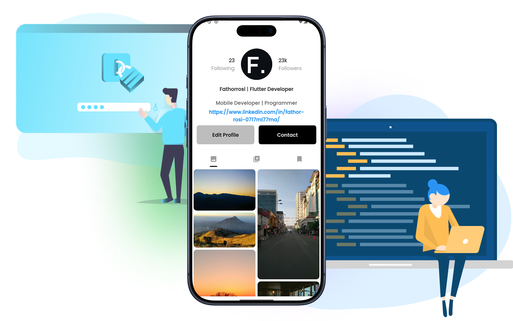

# Instagram Redesign

[](https://flutter.dev)
[](https://dart.dev)
[](https://opensource.org/licenses/MIT)
[](https://flutter.dev/multi-platform)

A modern Flutter application featuring a beautifully redesigned Instagram-inspired user interface. This project showcases a responsive profile view with tabbed navigation, featuring a masonry grid layout for displaying image feeds, reels, and tagged content. Built with Material Design 3 and Dark/Light theme support.



## 📋 Table of Contents

- [Features](#-features)
- [Tech Stack](#-tech-stack)
- [Installation](#-installation)
- [Usage](#-usage)
- [Project Structure](#-project-structure)
- [Configuration](#-configuration)
- [Contributing](#-contributing)
- [Testing](#-testing)
- [Roadmap](#-roadmap)
- [License](#-license)
- [Contact](#-contact)

## ✨ Features

- **Responsive Design**: Optimized for mobile, tablet, and web platforms
- **Dark & Light Themes**: Full Material Design 3 theme support with system-aware theme switching
- **Tabbed Navigation**: Three-tab interface for different content views
  - 📸 **Feed View**: Masonry grid layout displaying image galleries
  - 🎬 **Reels View**: Short-form video content interface
  - 🏷️ **Tagged View**: User-tagged content showcase
- **Profile Header**: Beautiful profile section with user statistics and avatar
- **Adaptive UI**: Automatically adapts to user's system theme preferences
- **Cross-Platform**: Runs on Android, iOS, Web, Linux, Windows, and macOS
- **Material Design 3**: Modern, clean UI following Google's latest design standards

## 🛠 Tech Stack

### Languages & Frameworks
- **Dart** (v3.10.7+) - Programming language
- **Flutter** - Cross-platform mobile, web, and desktop framework

### Key Dependencies
- **flutter** - Core Flutter framework
- **go_router** (v17.0.1) - Declarative routing and navigation
- **flutter_staggered_grid_view** (v0.7.0) - Masonry/staggered grid layouts
- **google_fonts** (v7.0.0) - Typography library for custom fonts
- **cupertino_icons** (v1.0.8) - iOS-style icons

### Development Dependencies
- **flutter_test** - Testing framework
- **flutter_lints** (v6.0.0) - Lint rules for code quality

## 📦 Installation

### Prerequisites
- Flutter SDK (v3.10.7 or higher) - [Install Flutter](https://flutter.dev/docs/get-started/install)
- Dart SDK (included with Flutter)
- Git
- A code editor (VS Code, Android Studio, or IntelliJ IDEA recommended)

### Step-by-Step Setup

1. **Clone the repository**
```bash
git clone https://github.com/fathorrosi-dev/instagram_redesign.git
cd instagram_redesign
```

2. **Get Flutter dependencies**
```bash
flutter pub get
```

3. **Run the app**

   For Android:
   ```bash
   flutter run -d <device_id>
   ```

   For iOS:
   ```bash
   flutter run -d <device_id>
   ```

   For Web:
   ```bash
   flutter run -d chrome
   ```

   For Desktop (Linux/macOS/Windows):
   ```bash
   flutter run -d linux    # or macos, windows
   ```

4. **List available devices**
```bash
flutter devices
```

### Environment Setup (Optional)

To use a specific Flutter channel:
```bash
flutter channel <channel>  # stable, beta, dev, master
flutter upgrade
```

## 🚀 Usage

### Running the Application

The application starts with a home screen displaying a profile view. Users can navigate between three main tabs:

```bash
# Development mode
flutter run

# Release mode (optimized)
flutter run --release

# Profile mode (performance testing)
flutter run --profile
```

### Basic App Structure

```dart
void main() {
  runApp(const MyApp());
}
```

The app uses `MaterialApp.router` for navigation management through the Go Router package.

### Theme Configuration

The app automatically responds to system theme settings:
- **Light Theme**: Clean white background with dark text
- **Dark Theme**: Dark background with light text

Access theme data in your widgets:
```dart
Theme.of(context).textTheme.titleLarge
Theme.of(context).colorScheme.primary
```

### Navigation

Navigation is handled through Go Router. Routes are defined in [lib/screen/utils/router.dart](lib/screen/utils/router.dart):

```dart
GoRoute(
  name: 'homeScreen',
  path: '/',
  builder: (context, state) => const HomeScreen(),
)
```

To navigate programmatically:
```dart
context.go('/');
context.goNamed('homeScreen');
```

## 📁 Project Structure

```
instagram_redesign/
├── lib/
│   ├── main.dart                          # App entry point
│   └── screen/
│       ├── home_screen/
│       │   ├── home_screen.dart           # Main home screen with tabs
│       │   └── components/
│       │       ├── feed_view.dart         # Masonry grid feed
│       │       ├── reels_view.dart        # Reels content view
│       │       └── tagged_view.dart       # Tagged content view
│       ├── styles/
│       │   ├── theme.dart                 # App theme configuration
│       │   ├── text_themes.dart           # Typography styles
│       │   ├── card_themes.dart           # Card component styles
│       │   ├── elevated_button_themes.dart # Button styles
│       │   ├── icon_themes.dart           # Icon styles
│       │   └── input_themes.dart          # Input field styles
│       └── utils/
│           └── router.dart                # Navigation configuration
├── assets/
│   └── images/                            # Image assets
├── android/                               # Android-specific code
├── ios/                                   # iOS-specific code
├── web/                                   # Web platform code
├── windows/                               # Windows platform code
├── macos/                                 # macOS platform code
├── linux/                                 # Linux platform code
├── pubspec.yaml                           # Project dependencies
├── analysis_options.yaml                  # Linting rules
└── README.md                              # This file
```

### Key Directories Explained

| Directory | Purpose |
|-----------|---------|
| `lib/` | Dart source code for the application |
| `lib/screen/` | UI screens and components |
| `lib/screen/styles/` | Theme and styling configuration |
| `lib/screen/utils/` | Utility functions and routing |
| `assets/images/` | Image files used in the app |
| `android/`, `ios/`, etc. | Platform-specific native code |

## ⚙️ Configuration

### Theme Customization

Edit [lib/screen/styles/theme.dart](lib/screen/styles/theme.dart) to customize the app's appearance:

```dart
static ThemeData lightTheme = ThemeData(
  useMaterial3: true,
  brightness: Brightness.light,
  colorScheme: ColorScheme.light(
    primary: Colors.black,
    secondary: Colors.grey.shade300,
  ),
  scaffoldBackgroundColor: Colors.white,
  // ... more configurations
);
```

### Adding Images

Place image files in the `assets/images/` directory and declare them in [pubspec.yaml](pubspec.yaml):

```yaml
flutter:
  assets:
    - assets/images/
```

Then reference them in code:
```dart
Image.asset('assets/images/logo.png')
```

### Grid Layout Customization

Customize the masonry grid in [lib/screen/home_screen/components/feed_view.dart](lib/screen/home_screen/components/feed_view.dart):

```dart
MasonryGridView.count(
  crossAxisCount: 2,  // Number of columns
  mainAxisSpacing: 7,  // Vertical spacing
  crossAxisSpacing: 7, // Horizontal spacing
  // ...
)
```

## 🤝 Contributing

Contributions are welcome! Please follow these guidelines:

### Code Style

- Follow the [Dart Style Guide](https://dart.dev/guides/language/effective-dart/style)
- Use meaningful variable and function names
- Add comments for complex logic
- Use type annotations

### Making Changes

1. **Fork the repository**
```bash
git clone https://github.com/your-username/instagram_redesign.git
cd instagram_redesign
```

2. **Create a feature branch**
```bash
git checkout -b feature/your-feature-name
```

3. **Make your changes and commit**
```bash
git add .
git commit -m "feat: add your feature description"
```

4. **Push to your fork**
```bash
git push origin feature/your-feature-name
```

5. **Create a Pull Request**
   - Go to the original repository
   - Click "New Pull Request"
   - Select your branch and describe your changes

### Pull Request Process

- Ensure code follows Dart style guidelines
- Test your changes on multiple platforms if possible
- Update documentation as needed
- Keep commits atomic and meaningful
- Reference any related issues in your PR description

### Commit Message Convention

```
<type>: <subject>

<body>

<footer>
```

Types: `feat`, `fix`, `docs`, `style`, `refactor`, `test`, `chore`

Example:
```
feat: add dark mode support for feed view

Implement dark theme colors and improve contrast for better readability
in low-light environments.

Fixes #123
```

## 🧪 Testing

### Running Tests

```bash
# Run all tests
flutter test

# Run tests with coverage
flutter test --coverage

# Run specific test file
flutter test test/widget_test.dart
```

### Test File Location

Test files are located in the [test/](test/) directory:
```
test/
└── widget_test.dart
```

### Writing Tests

Example widget test:
```dart
void main() {
  testWidgets('FeedView renders correctly', (WidgetTester tester) async {
    await tester.pumpWidget(const MyApp());
    
    expect(find.byType(FeedView), findsOneWidget);
  });
}
```

### Code Quality

Run the analyzer to check for issues:
```bash
flutter analyze
```

Apply formatting rules:
```bash
dart format lib/ test/
```

## 🗺️ Roadmap

### Planned Features
- [ ] Backend API integration for dynamic content
- [ ] User authentication system (login/signup)
- [ ] Real image feed from database
- [ ] Video playback functionality
- [ ] Like/comment/share interactions
- [ ] User search and discovery
- [ ] Direct messaging
- [ ] Notifications system
- [ ] Push notifications
- [ ] Offline support with local caching
- [ ] Performance optimizations
- [ ] Accessibility improvements

### Future Improvements
- [ ] Advanced state management (Provider/Riverpod)
- [ ] Unit and integration tests
- [ ] CI/CD pipeline
- [ ] App signing and deployment

## 📄 License

This project is licensed under the MIT License - see the [LICENSE](LICENSE) file for details.

The MIT License permits:
- ✅ Commercial use
- ✅ Modification
- ✅ Distribution
- ✅ Private use

With the condition:
- ⚠️ License and copyright notice must be included

## 👥 Contact

**Project Author**: fathorrosi-dev

- 🔗 GitHub: [@fathorrosi-dev](https://github.com/fathorrosi-dev)
- 💼 Project Repository: [instagram_redesign](https://github.com/fathorrosi-dev/instagram_redesign)

### Support

For issues, bug reports, or feature requests, please:
1. Check existing [GitHub Issues](https://github.com/fathorrosi-dev/instagram_redesign/issues)
2. Create a new issue with detailed information
3. Include screenshots or error logs if applicable

---

## 📚 Additional Resources

- [Flutter Documentation](https://flutter.dev/docs)
- [Dart Language Guide](https://dart.dev/guides)
- [Material Design 3 Guidelines](https://m3.material.io)
- [Go Router Documentation](https://pub.dev/packages/go_router)
- [Flutter Staggered Grid View](https://pub.dev/packages/flutter_staggered_grid_view)

## 🎯 Quick Start Checklist

- [ ] Clone the repository
- [ ] Run `flutter pub get`
- [ ] Check Flutter installation: `flutter doctor`
- [ ] Run the app: `flutter run`
- [ ] Explore the codebase in `lib/`
- [ ] Review the [project structure](#-project-structure)
- [ ] Check out [contributing guidelines](#-contributing)

---

**Last Updated**: January 2026  
**Flutter Version**: 3.10.7+  
**Current Status**: 🚀 Active Development
